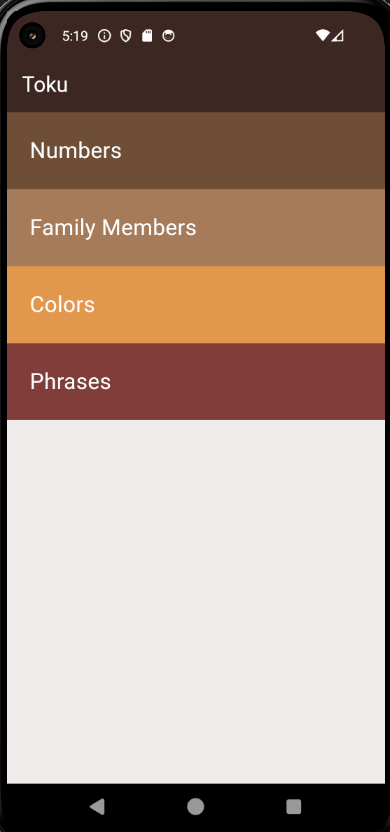

### Japanese language learning application
## toku app

## Application Overview
- This application is designed to provide an engaging and educational experience. It includes four main pages, each dedicated to teaching different aspects of early learning:

- 1- Home Page: The central hub of the app, where users can navigate to the various learning modules.

- 2- Numbers Learning: A section focused on teaching users the numbers, helping them to recognize and understand basic numerals.

- 3- Family Members' Names: This page introduces the names of various family members, offering a simple way to learn and memorize them.

- 4- Colors Learning: A vibrant section where users can learn the names of different colors, enhancing their ability to identify and recall colors.

- 5- Basic Sentences: This page provides a collection of basic sentences to help users start forming simple sentences in everyday situations.

---
- [Watch app UI]

