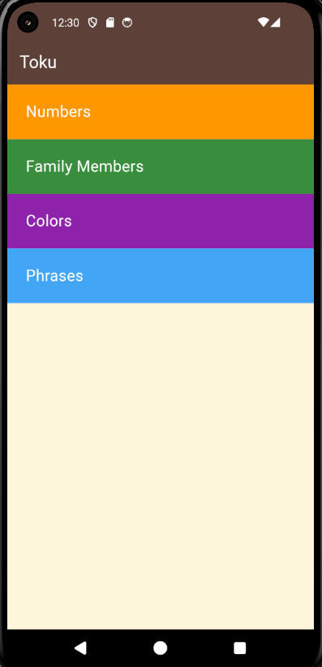

- refactor to (home page) >> screens
- Container widget >> Custom widget

```
class HomePage extends StatelessWidget {
  const HomePage({super.key});

  @override
  Widget build(BuildContext context) {
    return Scaffold(
        backgroundColor: const Color(0xffFEF6DB),
        appBar: AppBar(
          backgroundColor: Colors.brown[700],
          title: const Text('Toku', style: TextStyle(color: Colors.white)),
        ),
        body: Column(
          children: [
            Container(
              alignment: Alignment.centerLeft,
              padding: const EdgeInsets.only(left: 24),
              height: 70,
              width: double.infinity,
              color: Colors.orange,
              child: const Text(
                'Numbers',
                style: TextStyle(
                    color: Colors.white,
                    fontSize: 20,
                    fontWeight: FontWeight.w400),
              ),
            ),
            Container(
              alignment: Alignment.centerLeft,
              padding: const EdgeInsets.only(left: 24),
              height: 70,
              width: double.infinity,
              color: Colors.green[700],
              child: const Text(
                'Family Members',
                style: TextStyle(
                    color: Colors.white,
                    fontSize: 20,
                    fontWeight: FontWeight.w400),
              ),
            ),
            Container(
              alignment: Alignment.centerLeft,
              padding: const EdgeInsets.only(left: 24),
              height: 70,
              width: double.infinity,
              color: Colors.purple[600],
              child: const Text(
                'Colors',
                style: TextStyle(
                    color: Colors.white,
                    fontSize: 20,
                    fontWeight: FontWeight.w400),
              ),
            ),
            Container(
              alignment: Alignment.centerLeft,
              padding: const EdgeInsets.only(left: 24),
              height: 70,
              width: double.infinity,
              color: Colors.blue[400],
              child: const Text(
                'Phrases',
                style: TextStyle(
                    color: Colors.white,
                    fontSize: 20,
                    fontWeight: FontWeight.w400),
              ),
            ),
          ],
        ),
      );
  }
}
```


```
class HomePage extends StatelessWidget {
  const HomePage({super.key});

  @override
  Widget build(BuildContext context) {
    return Scaffold(
      backgroundColor: const Color(0xffFEF6DB),
      appBar: AppBar(
        backgroundColor: Colors.brown[700],
        title: const Text('Toku', style: TextStyle(color: Colors.white)),
      ),
      body: Column(
        children: [
          const Category(
            text: 'Numbers',
            color: Colors.orange,
          ),
          Category(
            text: 'Family Members',
            color: Colors.green[700],
          ),
          Category(
            text: 'Colors',
            color: Colors.purple[600],
          ),
          Category(
            text: 'Phrases',
            color: Colors.blue[400],
          ),
        ],
      ),
    );
  }
}

class Category extends StatelessWidget {
  const Category({super.key, required this.text, required this.color});

  final String? text;
  final Color? color;

  @override
  Widget build(BuildContext context) {
    return Container(
      alignment: Alignment.centerLeft,
      padding: const EdgeInsets.only(left: 24),
      height: 70,
      width: double.infinity,
      color: color,
      child: Text(
        text!,
        style: const TextStyle(
            color: Colors.white, fontSize: 20, fontWeight: FontWeight.w400),
      ),
    );
  }
}
```

---
- ( Navigation ) move from screen to another
### GestureDetector widget
- enable click on (Container , Picture , .... )
### VoidCallback
- == Function ( )
- empty function
### Navigator
- (method)
- (push) >> way of showing second (final) page
- (context) >> place of first screen (putting second on it)
- (route) >> class responsible for building a widget (screen) is placed on the main widget
```
onTap: () {
    Navigator.push(context, route)
  },
```
### MaterialPageRoute
- return widget
```
onTap: () {
  Navigator.push(context,
      MaterialPageRoute(builder: (BuildContext context) {
    return const NumbersPage();
  }));
},
```

---
### ListView
- ( widget )
- Build all widgets together at the same time
```
body: ListView(
  children: [
    Numbers(number: numbers[0]),
    Numbers(number: numbers[1]),
    Numbers(number: numbers[2]),
    Numbers(number: numbers[3]),
    Numbers(number: numbers[4]),
    Numbers(number: numbers[5]),
    Numbers(number: numbers[6]),
    Numbers(number: numbers[7]),
    Numbers(number: numbers[8]),
    Numbers(number: numbers[9]),
  ],
),
```


----
### getList
- ( method ) >> return of ( List of Widget )
```
body: ListView(
  children: getList(numbers)
),
```
```
List<Widget> getList(List<Number> numbers) {
  List<Numbers> numberList = [];
  for (int i = 0; i < numbers.length; i++) {
    numberList.add(Numbers(number: numbers[i]));
  }
  return numberList;
}
```

---
### ListView.builder
- == Loop
- It builds the widget displayed on the screen only, and when we come to scroll, it builds the other of the widgets
```
body: ListView.builder(
  itemCount: numbers.length,
  itemBuilder: (context, numIndex) {
    return Numbers(number: numbers[numIndex]);
  },
),
```

---
### IconButton